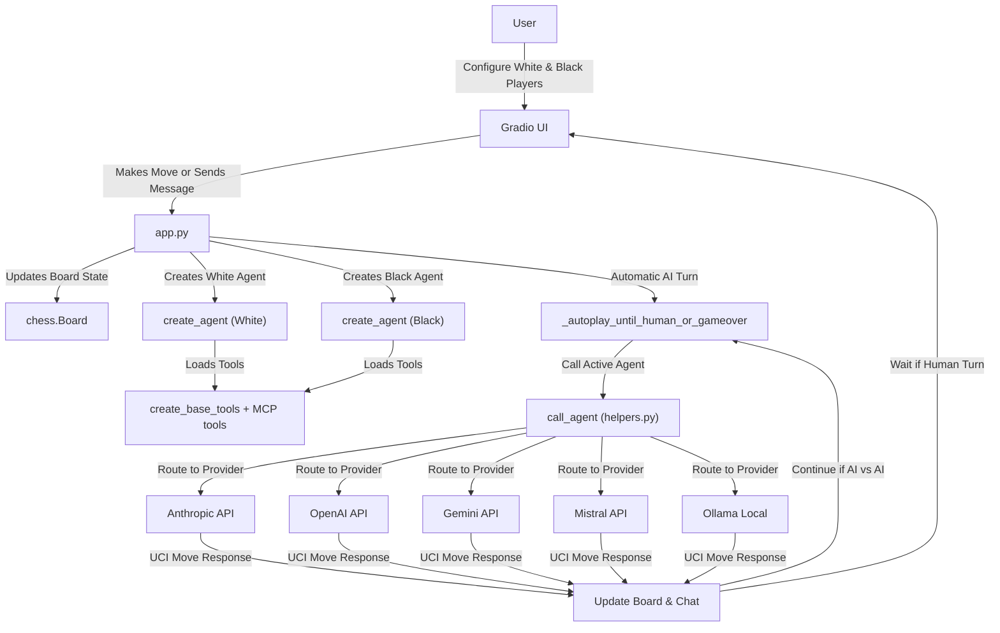

# ChessLM Codebase Overview

## Project Structure

- `app.py`: Main application with Gradio UI, dual-player management, and automatic AI turn execution
- `utils/helpers.py`: Agent creation functions supporting multiple LLM providers (Anthropic, OpenAI, Gemini, Mistral, Ollama)
- `utils/tools.py`: Chess interaction tools, UCI move validation, and MCP server integration
- `requirements.txt`: Python dependencies including all LLM provider packages
- `README.md`: Project documentation and setup instructions
- `.env`: Environment file for API key configuration (user-created)

## Architecture Overview

ChessLM supports flexible player configurations:
- **White Player:** Human, Anthropic, OpenAI, Gemini, Mistral, or Ollama
- **Black Player:** Human, Anthropic, OpenAI, Gemini, Mistral, or Ollama
- **Automatic AI Gameplay:** AI agents play moves without manual intervention
- **Mixed Modes:** Any combination (Human vs AI, AI vs AI, Human vs Human)

## Workflow

1. **User opens the Gradio web interface**
2. **User configures players:**
   - Select provider (Human/Anthropic/OpenAI/Gemini/Mistral/Ollama) for White and Black
   - Enter model names and API keys for AI players
   - Load environment variables from .env file for default keys
3. **Game interaction:**
   - **Human Turn:** Click board to make moves or send chat messages
   - **AI Turn:** Agent automatically analyzes position and plays moves using UCI format
   - **Mixed Games:** Seamless transitions between human and AI turns
4. **Automatic AI vs AI gameplay:**
   - `_autoplay_until_human_or_gameover()` manages continuous AI play
   - Configurable maximum move limits prevent infinite games
   - Real-time chat updates show AI reasoning
5. **Chat system routes to active player's AI agent for analysis and responses**

## Components Diagram

## Component Roles

- **Gradio UI**: Dual-player configuration interface, interactive chessboard, and real-time chat
- **app.py**: Main orchestrator handling player routing, automatic AI turns, and game state management
- **helpers.py**: Multi-provider agent creation and LLM communication with environment variable support
- **tools.py**: Chess analysis tools, UCI move validation, MCP server integration, and move format conversion
- **LLM APIs**: External language model providers with consistent UCI move format requirements

## Key Technical Features

### Multi-Provider Support
- **Anthropic**: Claude models via langchain-anthropic
- **OpenAI**: GPT models via langchain-openai  
- **Google Gemini**: Gemini models via langchain-google-genai
- **Mistral**: Mistral models via langchain-mistralai
- **Ollama**: Local models via langchain-ollama

### Move Format Management
- **UCI Standard**: All moves use Universal Chess Interface format (e.g., "e2e4", "g1f3")
- **Format Validation**: Automatic detection and conversion of algebraic notation attempts
- **Error Handling**: Clear error messages with legal move suggestions for invalid formats

### Environment Configuration
- **API Key Management**: Secure storage via .env files with fallback to UI input
- **Model Defaults**: Pre-configured model names and settings for each provider
- **Automatic Loading**: Environment variables loaded at application startup

### Game Flow Management
- **Turn Detection**: Automatic identification of active player based on board state
- **AI Automation**: Continuous AI vs AI gameplay with configurable move limits
- **Human Interaction**: Seamless switching between automated and manual play modes

---

Let me know if you want a more detailed breakdown of any part or a different diagram style!
